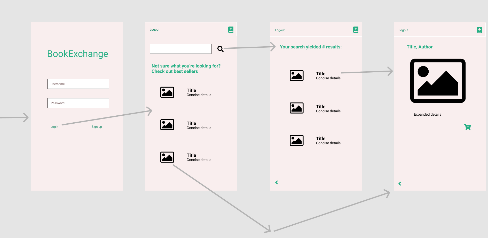

# BookExchange

## Table of Contents
1. [Overview](#Overview)
1. [Product Spec](#Product-Spec)
1. [Wireframes](#Wireframes)
2. [Schema](#Schema)

## Overview
### Description
Allows users to post and search for books they'd like to sell, trade, or buy.

### App Evaluation

- **Category:** 
Shopping 
- **Mobile:**  Currently, this application is limited to mobile functionality, but future versions could include a web application.
- **Story:** Users can post books for sale/trade as well as search and shop for desired books.
- **Market:** Any user interested in buying, trading, or selling books.
- **Habit:** Users would use this as often as they needed to buy, sell, or trade books.
- **Scope:** Allowing users to connect and exchange books.

## Product Spec

### 1. User Stories (Required and Optional)

**Required Must-have Stories**

***Milestone 1***
- [x] User should be able to register an account
- [x] User should be able to login
- [x] Login should be persistent
- [x] User should be able to log out


***Milestone 2***
- [ ] User should see top sellers on search screen (by default) before a query is sent
- [ ] Allow user to search by author, title, isbn

***Milestone 3***
- [ ] User should be able to post book for sale/trade/buy
- [ ] User should be able to delete their own posts

***Milestone 4***
- [ ] User should be able to click on any book listing for more detail


**Optional Nice-to-have Stories**

* Filter results by buy/sell/trade
* Integrate with NYTimes book API (or similar) to mitigate user error
* Compare against store listing price
* Users should be able to message seller/buyer to initiate sale
* User should be able to see previous sales/buys they've done
* User should be able to rate transactions with others users
* User should be able to post book review


### 2. Screen Archetypes

* Login/Register
   * User should be able to register an account
   * User should be able to login
* Search Screen
   * User should see top sellers on search screen (by default) before a query is sent
   * Allow user to search by author, title, genre
* Detailed Screen
  * User should be able to click on any book listing for more detail
* Post Book Screen
  * User should be able to post book for sale/trade/buy


### 3. Navigation

**Tab Navigation** (Tab to Screen)

* Logout
* Post

**Flow Navigation** (Screen to Screen)

* Login
   * Login (submit)
   * Register
* Search Screen
   * Search
   * Clicking on an individual listing will lead to Detailed Screen
* Detailed Screen
   * Back button (goes back to Search Screen)
* Post Book Screen
  * Post (submits new listing to our backend and returns)
* Confirmation screen
  * Back (Goes back to search screen-> stetch: display listing history)
  

## Wireframes



## Schema 
### Models

Property | Type | Description
------------ | ------------- | -------------
objectId | String | Unique identifier
poster | pointer to User | Book listing author
image | File | Image of book
title | String | Title of book
author | String | Author of book
genre | String | Genre of book
ISBN | String | ISBN of book
synopsis | String | Synopsis of book
type | String | Type of post (buy/sell/trade)
createdAt | Date | Date/time book listing was posted
updatedAt | Date | Date/time book listing was updated


### Networking
#### List of network requests by screen
   - Login
      - (Create/POST) Create a User object
      - (Read/GET) Authenticate User to login

   - Search Screen 
      - (Read/GET) Query posts to find book posts
      ```swift
         let query = PFQuery(className:"Post")
         query.whereKey("poster", equalTo: currentUser)
         query.order(byDescending: "dateAdded")
         query.findObjectsInBackground { (posts: [PFObject]?, error: Error?) in
            if let error = error { 
               print(error.localizedDescription)
            } else if let posts = posts {
               print("Successfully retrieved \(posts.count) posts.")
           // TODO: Do something with posts...
            }
         }
         ```
   - Detailed Screen
      - (Read/GET) Query posts for selected book
   - Post Book Screen
      - (Create/POST) Create a new post object
      - (Delete) Delete a post object
   - NYT Book API
      - Current Best Sellers: https://api.nytimes.com/svc/books/v3/lists/{date}/{list}.json (For default results displayed on Search screen)
      - Search by ISBN: https://api.nytimes.com/svc/books/v3/reviews.json?isbn={isbn} (For Posting Book for sale/trade/buy)
