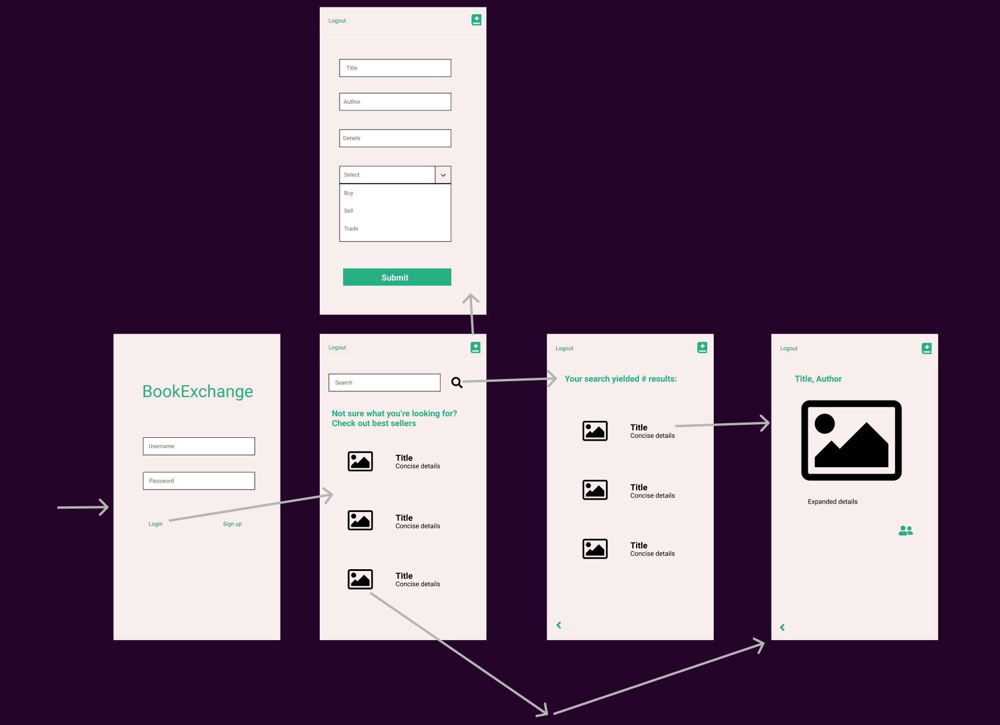

# BookExchange

## Table of Contents
1. [Overview](#Overview)
1. [Product Spec](#Product-Spec)
1. [Wireframes](#Wireframes)
2. [Schema](#Schema)

## Overview
### Description
Allows users to post and search for books they'd like to sell, trade, or buy.

### App Evaluation

- **Category:** 
Shopping 
- **Mobile:**  Currently, this application is limited to mobile functionality, but future versions could include a web application.
- **Story:** Users can post books for sale/trade as well as search and shop for desired books.
- **Market:** Any user interested in buying, trading, or selling books.
- **Habit:** Users would use this as often as they needed to buy, sell, or trade books.
- **Scope:** Allowing users to connect and exchange books.

## Product Spec

### 1. User Stories (Required and Optional)

**Required Must-have Stories**

***Milestone 1***
- [x] User should be able to register an account
- [x] User should be able to login
- [x] Login should be persistent
- [x] User should be able to log out


***Milestone 2***
- [x] User should see top sellers on search screen (by default) before a query is sent
- [x] User should be able to click on Best Seller images to search for those books
- [x] Allow user to search by isbn


***Milestone 3***
- [x] User should be able to post book for sale/trade/buy
- [x] User should be able to autofill details for their book based on ISBN (with help of isbnDB API) to mitigate user input error


***Milestone 4***
- [ ] User should be able to click on any book listing for more detail


**Optional Nice-to-have Stories**

* Filter results by buy/sell/trade
* Compare against store listing price
* Users should be able to message seller/buyer to initiate sale
* Users should be able to see their current posts
* User should be able to delete their own posts
* User should be able to see previous sales/buys they've COMPLETED
* User should be able to rate transactions with others users
* User should be able to post book review
* User should be able to search by author/title


### 2. Screen Archetypes

* Login/Register
   * User should be able to register an account
   * User should be able to login
* Search Screen
   * User should see top sellers on search screen (by default) before a query is sent
   * Allow user to search by isbn
* Detailed Screen
  * User should be able to click on any book listing for more detail
* Post Book Screen
  * User should be able to post book for sale/trade/buy


### 3. Navigation

**Tab Navigation** (Tab to Screen)

* Logout
* Post

**Flow Navigation** (Screen to Screen)

* Login
   * Login (submit)
   * Register
* Search Screen
   * Search
   * Clicking on an individual listing will lead to Detailed Screen
* Detailed Screen
   * Back button (goes back to Search Screen)
* Post Book Screen
  * Post (submits new listing to our backend and returns)
* Confirmation screen
  * Back (Goes back to search screen-> stetch: display listing history)
  

## Wireframes



## Schema 
### Models

Property | Type | Description
------------ | ------------- | -------------
objectId | String | Unique identifier
poster | pointer to User | Book listing author
image | String | URL of book cover
title | String | Title of book
author | String | Author of book
isbn | String | ISBN of book
details | String | Synopsis of book
cutom_details | String | User's description of the condition of the book they want to buy/sell/trade
type | String | Type of post (buy/sell/trade)
createdAt | Date | Date/time book listing was posted
updatedAt | Date | Date/time book listing was updated


### Networking
#### List of network requests by screen
   - Login
      - (Create/POST) Create a User object
      - (Read/GET) Authenticate User to login

   - Search Screen 
      - (Read/GET) Query posts to find book posts
      ```swift
         let query = PFQuery(className:"Post")
         query.whereKey("poster", equalTo: currentUser)
         query.order(byDescending: "dateAdded")
         query.findObjectsInBackground { (posts: [PFObject]?, error: Error?) in
            if let error = error { 
               print(error.localizedDescription)
            } else if let posts = posts {
               print("Successfully retrieved \(posts.count) posts.")
           // TODO: Do something with posts...
            }
         }
         ```
   - NYT Book API
      - Current Best Sellers: https://api.nytimes.com/svc/books/v3/lists/current/combined-print-and-e-book-fiction.json (For suggested books to search on Search screen)      
   - Detailed Screen
      - (Read/GET) Query Posts for selected book (by isbn)
   - Post Book Screen
      - (Create/POST) Create a new Post object
      ```swift
          Post post = new Post();
          post.setCustomDescription(custom);
          post.setTitle(title);
          post.setISBN(isbn);
          post.setAuthor(author);
          post.setImgUrl(imgUrl);
          post.setPoster(user);
          post.setType(type);

          post.saveInBackground(new SaveCallback() {
              @Override
              public void done(ParseException e) {
                  if(e != null){
                      // there's a problem
                      Log.e(TAG, "Problem saving post", e);
                      Toast.makeText(getContext(), "Problem saving post", Toast.LENGTH_SHORT).show();

                  }
                  else {

                      Log.i(TAG, "Post saved");
                      etCustom.setText("");
                      etTitle.setText("");
                      etAuthor.setText("");
                      etImgURL.setText("");
                      etISBN.setText("");


                  }
              }
      ```
      - [isbnDB API](https://isbndb.com/apidocs/v2): Search by ISBN: https://api2.isbndb.com/book/{isbn} (to autofill book details based on ISBN for user posts)
